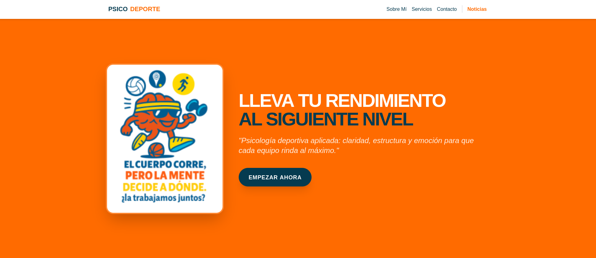
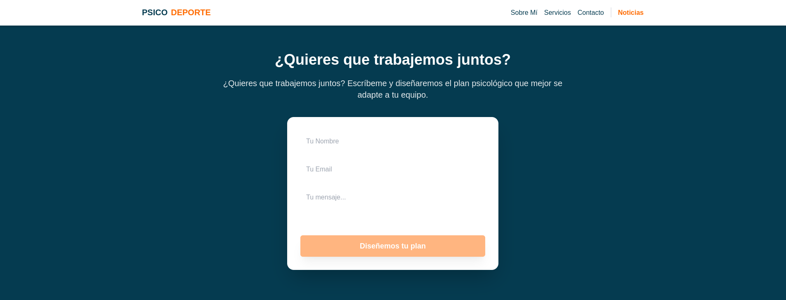
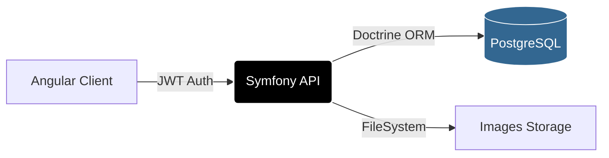
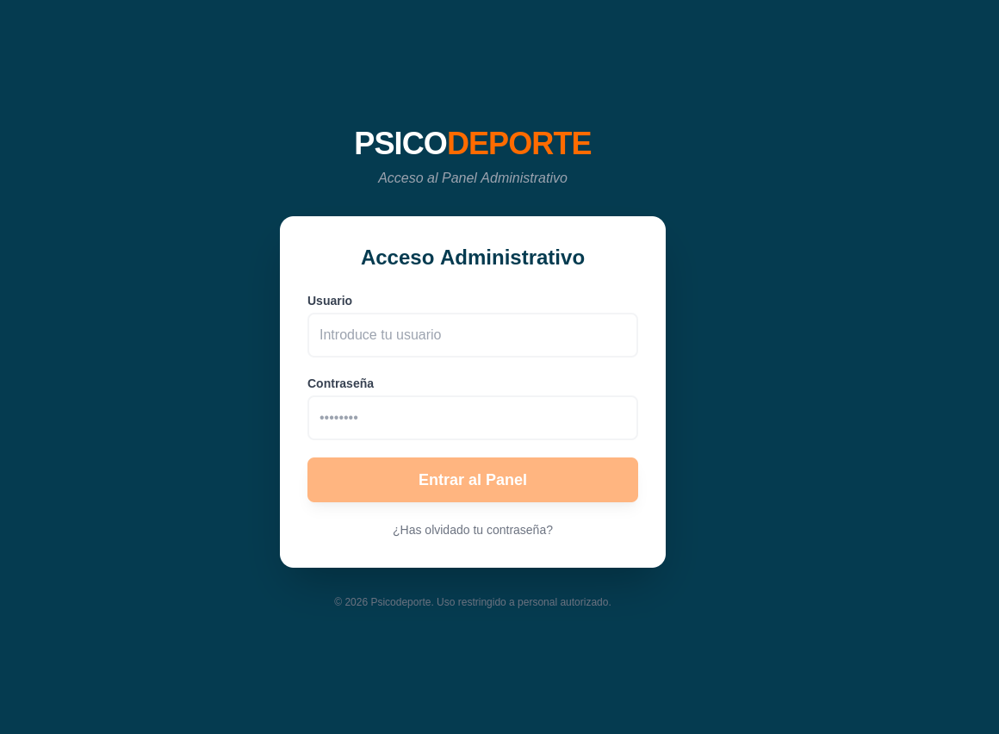
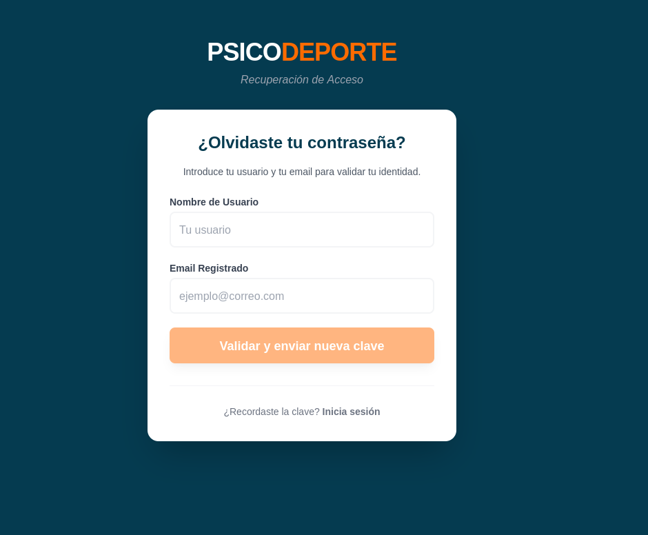
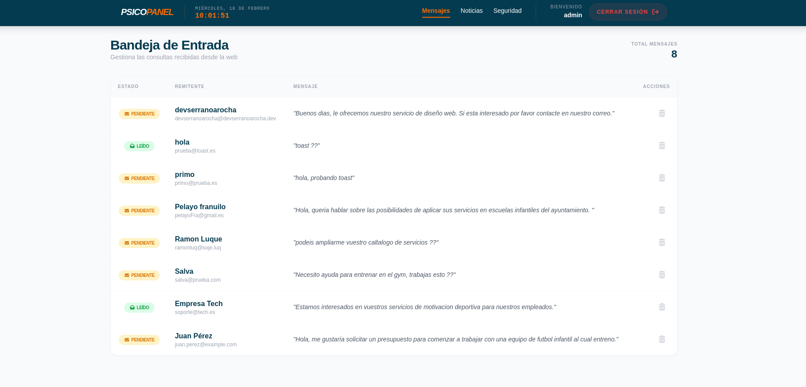
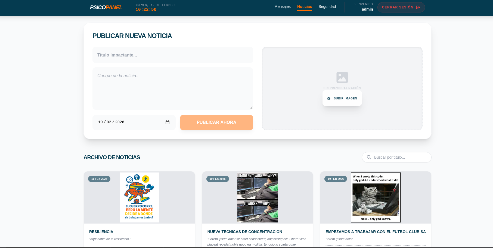
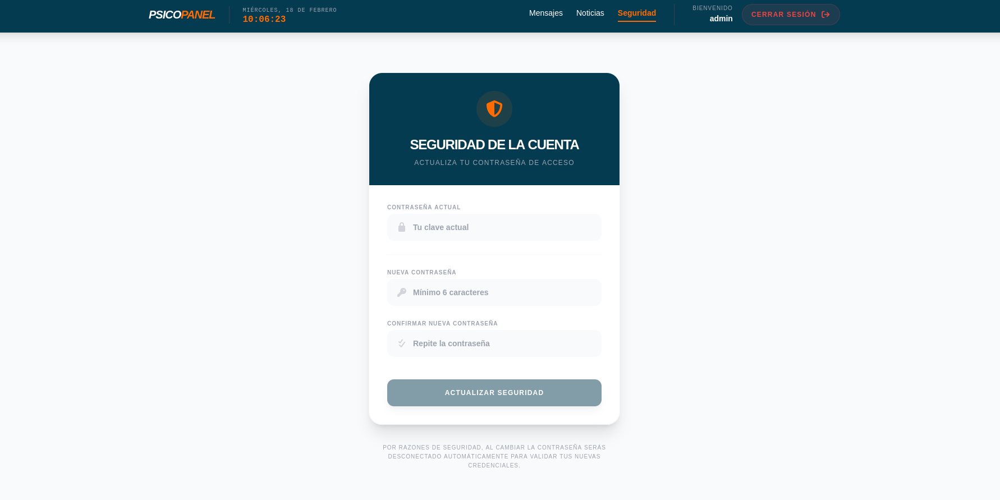

# 🧠 Psicodeporte - Portal de Gestión para Psicología Deportiva

[](https://symfony.com/)
[](https://angular.io/)
[](https://www.docker.com/)

 

 Proyecto Fullstack diseñado para la gestión integral de un gabinete de psicología deportiva. Este repositorio es una muestra técnica de mi capacidad para construir aplicaciones robustas y seguras utilizando el ecosistema **PHP/Symfony** en el backend y **Angular** en el frontend.

---

## 🚀 Perfil Tecnológico Destacado

Como aspirante a Desarrollador Backend PHP, este proyecto ha sido el escenario para implementar estándares profesionales en Symfony:

* **Arquitectura de API RESTful:** Diseño de endpoints siguiendo los principios de statelessness y recursos bien definidos.
* **Seguridad Avanzada (JWT):** Implementación de autenticación mediante `lexik/jwt-authentication-bundle` para la protección de la zona administrativa.
* **Persistencia con Doctrine ORM:** Modelado de datos complejo, uso de repositorios personalizados y gestión de migraciones para PostgreSQL.
* **Validación de Datos:** Uso de *Constraints* de Symfony para asegurar la integridad de los datos en formularios y carga de archivos.
* **Gestión de Archivos:** Servicio de gestión de imágenes (upload/update/delete) integrado en el servidor Symfony.
* **Inyección de Dependencias:** Uso intensivo de servicios desacoplados para mantener un código limpio y mantenible (SOLID).

---

## 🛠️ Stack Tecnológico

### Backend
* **Framework:** Symfony 7.2.5
* **Lenguaje:** PHP 8.2.29 (uso de Atributos y Tipado Estricto).
* **Seguridad:** JWT (JSON Web Tokens).
* **Base de Datos:** PostgreSQL.
* **Infraestructura:** Docker & Docker Compose.

### Frontend
* **Framework:** Angular 19.2.8 (Standalone Components).
* **Estilos:** Tailwind CSS.
* **UX/UI:** ngx-toastr para notificaciones y Reactive Forms para validaciones en tiempo real.

### Arquitectura de Comunicación



---

## 🌟 Funcionalidades Clave






1.  **Dashboard Administrativo:** Gestión centralizada de mensajes y noticias protegida por roles.
2.  **Motor de Noticias:** CRUD completo con previsualización dinámica y tratamiento de imágenes en servidor.
3.  **Centro de Mensajería:** Sistema de contacto con gestión de estados (Pendiente/Leído) y borrado lógico.
4.  **Seguridad de Usuario:** Sistema de cambio de credenciales con hashing seguro y validación cruzada.
5.  **Firma en Consola:** Mensaje de autoría personalizado mediante CSS en la consola del navegador para desarrolladores.

---

## 🏗️ Mejoras Futuras y Escalabilidad

Para demostrar mi compromiso con la calidad y evolución del software, tengo planificadas las siguientes implementaciones:

* **[Backend] Testing Automatizado:** Implementación de pruebas unitarias y de integración utilizando **PHPUnit** para asegurar la estabilidad de la lógica de negocio.
* **[Backend] API Documentation:** Integración de **NelmioApiDocBundle** (Swagger) para documentar y probar los endpoints de forma interactiva.
* **[Backend] Messenger & Queues:** Implementación del componente Messenger de Symfony para el envío asíncrono de correos electrónicos tras el formulario de contacto.
* **[Frontend] State Management:** Migración a **NgRx** para gestionar estados complejos si la aplicación crece en volumen de datos.
* **[Infraestructura] CI/CD:** Configuración de **GitHub Actions** para el despliegue automático y ejecución de tests en cada push.

---

## 📦 Despliegue con Docker Compose

Este proyecto utiliza Docker y Docker Compose para desplegar una aplicación que incluye un backend Symfony, un frontend Angular y una base de datos PostgreSQL de manera rápida y sencilla. Esto garantiza que funcione exactamente igual en cualquier entorno.

---

## 🛠️ Requisitos Previos
Antes de comenzar, asegúrate de tener instalados en tu sistema:

- [Docker](https://docs.docker.com/get-docker/)
- [Docker Compose](https://docs.docker.com/compose/install/)
---

## 🚀 Instalación y Puesta en Marcha

### 1️⃣ Clonar el repositorio
Ejecuta el siguiente comando para clonar el proyecto:
```bash
git clone https://github.com/devserranoarocha/psico-deporte
cd psico-deporte
```

### 2️⃣ Levantar los contenedores
Para iniciar los servicios en segundo plano, ejecuta:
```bash
docker-compose up -d
```
📌 **Nota:** La primera vez que inicies los servicios, puede tardar unos minutos en configurarse completamente.

### 3️⃣ Verificar que los contenedores están corriendo
Comprueba el estado de los contenedores con:
```bash
docker ps
```
Deberías ver tres contenedores en ejecución: **PostgreSQL**, **Symfony (backend)** y **Angular (frontend)**.

### 4️⃣ Acceder a la aplicación
- **Frontend:** Abre la siguiente URL en tu navegador:
  ```
  http://localhost:4200
  ```
- **Backend (Symfony):** Puedes ver la salida de Symfony desde:
  ```
  http://localhost:8000
  ```
- **Base de datos PostgreSQL:** El contenedor de la base de datos está en el puerto 5432, aunque normalmente no es necesario acceder directamente a este servicio en un navegador.

---

## 🔄 Detener y Reiniciar los Contenedores
Si deseas detener los contenedores en ejecución:
```bash
docker-compose down
```
Para volver a iniciarlos:
```bash
docker-compose up -d
```

---

## 🧹 Eliminar los Contenedores y Datos Persistentes
Si quieres eliminar los contenedores junto con los volúmenes y datos almacenados:
```bash
docker-compose down -v
```
⚠️ **Advertencia:** Esto eliminará todos los datos almacenados en la base de datos PostgreSQL.

---

## 🎯 Notas Finales
- Para ver los registros en tiempo real:
  ```bash
  docker-compose logs -f
  ```

Para más información sobre **Symfony**, **Angular** o **PostgreSQL**, consultar sus respectivas documentaciones oficiales.

## Comandos útiles

- Para acceder al contenedor del Frontend Angular:
```
  docker exec -it pd_frontend sh
```

- Para acceder al contenedor del Backend Symfony:
```
docker exec -it pd_backend bash
```
- Si tienes problemas de permisos para levantar un contenedor, prueba a ejecutar el siguiente comando:

```
sudo chmod 775 -R (contenedor_de_Symfony_o_Angular_frontend)
Ej:
sudo chmod 775 -R angular-frontend
```
